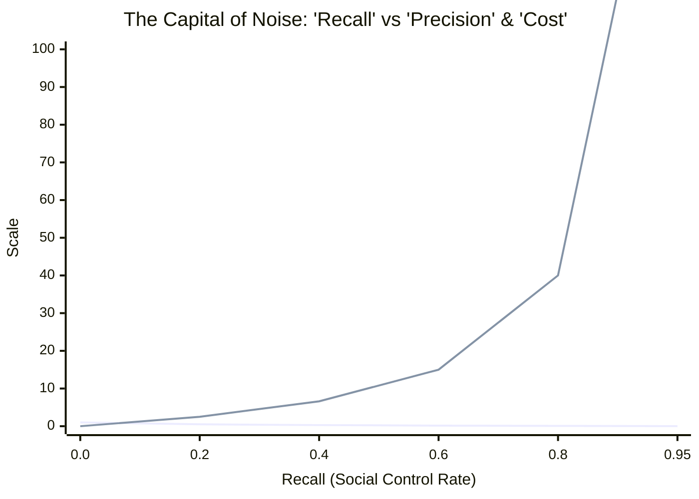
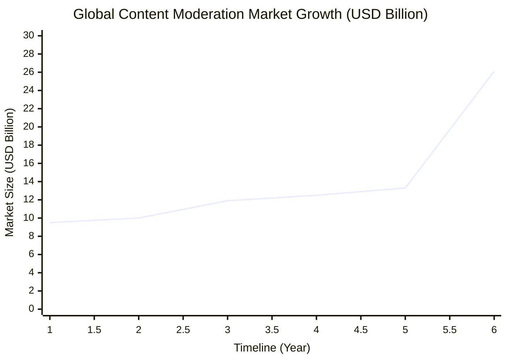
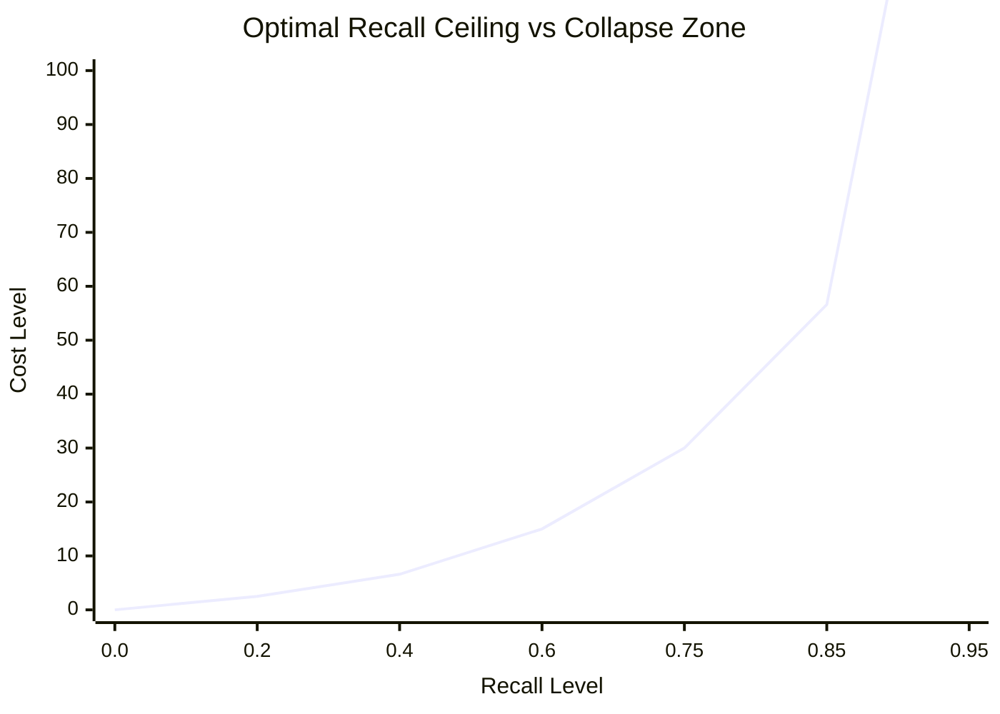
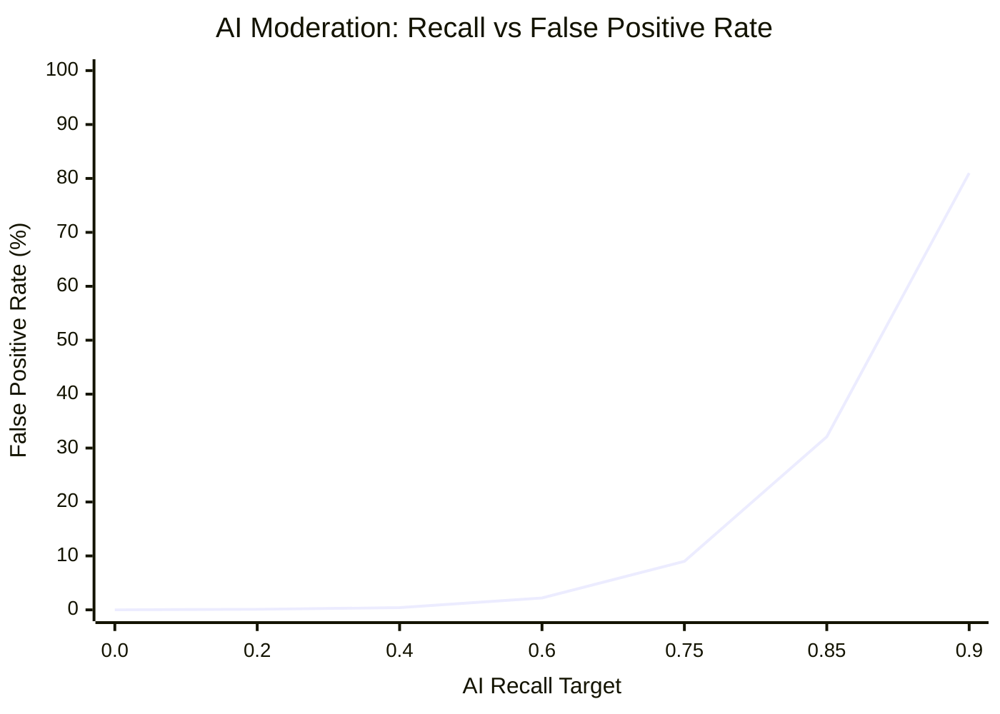
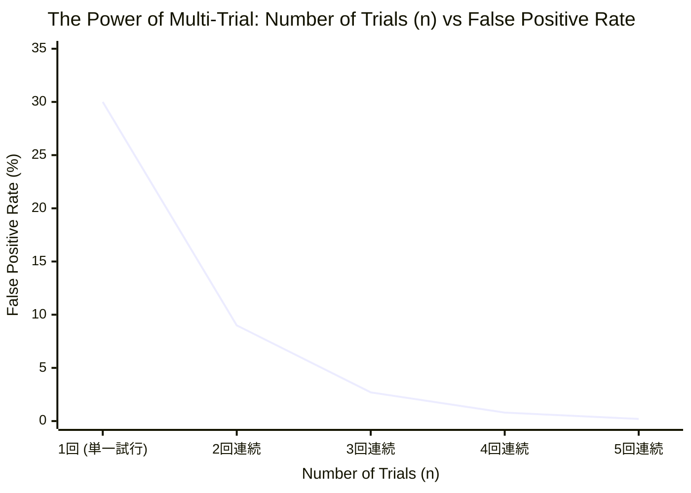

# プレシージョンとリコール
## 医療崩壊からビッグテックの過剰BANまでを支配する「悪魔の不等式」

### 要旨（Abstract）

本稿は、現代のアルゴリズム社会および組織統治において盲目的に追求されている「網羅主義（Recallの最大化）」が、システムの適合率（Precision / プレシージョン）を反比例の力学で破壊し、社会的なノイズ処理コストを指数関数的に暴走させる自壊メカニズムを数理モデルおよび実証ファクトを用いて解明するものである。

* **数理的実証**：医療崩壊や過剰コンプライアンスといった実社会の機能不全を起点とし、管理強度（Recall）が閾値（0.8）を超えた瞬間にコストが無限大へ発散する「システム崩壊ゾーン（System Collapse Zone）」の動態を実証する。
* **現代的ファクト**：現代のビッグテック（Meta等）が財政的自壊を免れるために推進した「生成AIモデレーションへの移行」が、今度は二乗の速度で「冤罪（過剰バン）」を爆発させるという機能的自壊の罠を明らかにする。
* **統治戦略の提唱**：網羅性の追求という設計思想そのものを根本から見直さない限り、アーキテクチャの変更（人間からAIへ）は崩壊の形態を変化させるに過ぎない。持続可能な統治戦略として、常用対数から導出される「工学的最適試行回数 $n^*$」に基づいた複数回試行（連記判定）のアーキテクチャへのパラダイムシフトを提唱する。

---

### 1. 概念の再定義：誰も逃れられない「網」の宿命

現代社会が陥っている機能不全の本質を解き明かすには、私たちが無意識に信奉している「正しさ」の基準を一度解体せねばならない。そのために、まずは「Precision（適合率）」と「Recall（再現率）」という、私たちの生活を裏で支配している2つのシンプルな概念を理解することから始めよう。

いま、ある街に1万人の住民がいて、その中に100人の「凶悪犯（または真に救うべき弱者、あるいは天才）」が紛れ込んでいるとする。この100人をピンポイントで見つけ出すために、警察が「網」を投げる状況をイメージしてほしい。

世の凡庸な人間たちは、物事を「正解」か「間違い」かという単純な2値（バイナリ）で捉えがちだ。しかし、データサイエンスの世界において、予測や判断の精度を評価する際には、この2値化は全く無意味である。私たちは、現実（真実）と予測（判定）が交錯して生まれる **「混同行列（Confusion Matrix）」** という4つの世界のモザイク画を直視しなければならない。

| | **真実：標的（凶悪犯）** | **真実：非標的（一般市民）** |
| :--- | :--- | :--- |
| **判定：陽性（逮捕）** | **True Positive (真陽性)**<br>本物を正しく逮捕する（真の正解） | **False Positive (偽陽性)**<br>無実を誤って逮捕する（冤罪・ノイズ） |
| **判定：陰性 (スルー)** | **False Negative (偽陰性)**<br>本物を見落として逃がす（未検挙） | **True Negative (真陰性)**<br>無実を正しくスルーする（健全な放置） |

この4値の構造を理解して初めて、私たちが議論すべき「Precision」と「Recall」という2つの全く異なる評価基準が定義可能となる。

*   **Recall（再現率）：** 100人の凶悪犯のうち、何人を捕まえられたかという「網羅性」の指標。数式で表せば $\frac{\text{True Positive}}{\text{True Positive} + \text{False Negative}}$ である。
*   **Precision（適合率）：** 警察が「お前が犯人だ」と判定して捕まえた全容疑者のうち、**「本当に凶悪犯だった人（True Positive）」が何パーセントいたかという「正確さ」**の指標。数式では $\frac{\text{True Positive}}{\text{True Positive} + \text{False Positive}}$ となる。

もし、上司や世論から「1人も凶悪犯を逃がすな！（Recall 100%を目指せ）」と命令されたら、警察はどうするだろうか。彼らは捕まえるハードル（閾値）を極限まで下げ、わずかでも怪しい動きをした者を片っ端から全員逮捕するしかない。

その結果、False Negative（見落とし）はゼロになり、凶悪犯は全員捕まる。しかしその引き換えとして、何千人もの「全く無実の一般市民（False Positive：偽陽性）」まで一緒に網に巻き込まれ、分母を爆発的に膨れ上がらせる。結果として、分母に対する本物の犯人の割合である「Precision（True Positiveの比率）」はゼロに向かって限りなく暴落する。

#### 数理の深淵：条件付き確率とベイズの定理による射影

この泥臭い警察の比喩を、より厳密な数理の言語で定式化してみよう。私たちが高校数学で学ぶ「条件付き確率」、あるいは大学で出会う「ベイズ統計学」のパースペクティブを通すと、このトレードオフは不可避の宇宙的真理として立ち現れる。

いま、ある事象が「真に価値あるもの（Target）」である状態を $T$、システムがそれを「陽性（Positive）」と判定する状態を $P$ とする。また、それぞれの補事象（非標的、陰性判定）を $T^c$, $P^c$ と表記する。

このとき、私たちが盲信する「Recall」とは、事象が真に標的であるという条件のもとで、システムが正しく陽性判定を下す条件付き確率 $P(P|T)$、すなわち医療統計における **「感度（Sensitivity）」** に他ならない。一方で、社会が真に担保すべき「Precision」とは、システムが陽性だと判定したという条件のもとで、それが真に標的である確率、すなわち**「事後確率（Posterior Probability）」** $P(T|P)$ である。

ベイズの定理（Bayes' theorem）を用いれば、この事後確率 $P(T|P)$ は以下の数式によって美しく、そして冷徹に記述される。

$$P(T|P) = \frac{P(P|T)P(T)}{P(P|T)P(T) + P(P|T^c)P(T^c)}$$

この数式が内包する絶望的な構造に気づだろうか。Recall、すなわち感度 $P(P|T)$ を $1$（100%）に漸近させようとするとき、システムは判定の閾値を緩和せねばならず、それは非標的を誤って陽性と判定する確率（偽陽性率） $P(P|T^c)$ の指数関数的な増大を招く。

さらに致命的なのは、現実社会において「真に価値あるものやリスク」の事前確率（尤度） $P(T)$ は、全体のわずか1%未満という極小のスパース（希薄）なデータであるという事実だ。分母の右項において、圧倒的多数派である正常分子 $P(T^c) \approx 1$ に対し、微小な割れ窓としての $P(P|T^c)$ が掛け合わされた瞬間、分母は爆発的に膨張する。

結果として、事後確率である **Precision $P(T|P)$ は無慈悲にゼロへと収束する。**

「1つも見落とさないこと（Recall）」を狂信的に追い求める行為は、ベイズのサンプリング空間において、システムが「正しい判断（Precision）」をあらかじめ構造的に自死させる宣言に等しい。これは人間の精神論や官僚的な努力で克服できる問題ではなく、確率論のトポロジーが突きつける絶対的な宿命なのである。

---

### 2. 破壊のメカニズム：網（Recall）の拡大がもたらすシステム自壊のコスト

では、社会や組織がPrecision（正確さ）を放棄し、網羅性（Recall）ばかりを追い求めて「1件の見落としも許さない」という網を広げると何が起きるのか。それこそが、管理コストと認知リソースの決定的な泥沼化である。

網を広げて判定のハードル（閾値）を下げるということは、システムが弾き出した「要対応リスト」の分母を爆発的に増やすことを意味する。たとえその中に本物が含まれていたとしても、人間社会はその巨大すぎる網の維持と、リストに並んだ膨大な容疑者の精査に、有限であるはずの富、時間、そして認知リソースを容赦なく注ぎ込むことになる。

歴史はこの「網羅主義という病理」が、いかに文明を内部から崩壊させていったかを冷徹に証明している。

#### ① 古代ローマ：マクロ経済を圧殺した「網羅的監視」
ローマ帝国後期、ディオクレティアヌス帝らは「脱税者や反乱分子を1人も見逃さない（Recallの最大化）」ために、全市民の職業を強制的に固定し、帝国の隅々にまで徴税官と密告者の網を張り巡らせた。

しかし、この網羅主義は帝国を救わなかった。システム全体のRecallを100%に近づけようとした結果、行政が処理・確認すべき「容疑者リスト（分母）」は天文学的な数字に達し、裁判所と官僚機構はその書類仕事と精査だけで肥大化・麻痺してしまったのである。

どれだけ怪しい者を網羅しても、それを処理するリソースが足りなければシステムは機能しない。True Positive（本物の摘発）の比率を無視して網の目だけを細かくした帝国は、外敵の侵略ではなく、自ら広げすぎた「網の維持コスト」と「リストの処理コスト」によって自滅したのである。

#### ② フランス革命：恐怖政治における「反革命分子」の網羅的摘発
1794年、ロベスピエール率いる公安委員会が主導したフランス革命の恐怖政治は、網羅性の追求が純粋な狂気へと変貌した典型例である。「共和国の敵、反革命分子を一人も漏らさず根絶する」という大義名分（Recallの極大化）のために制定された「プレリアル22日法」は、証拠の提出や精神的弁護の手続きをすべて簡略化し、逮捕・死刑のハードル（閾値）を極限まで引き下げた。

その結果、何が起きたか。わずかでも怪しい動きをした者を片っ端から網に掛けるシステムにしたため、単なる近隣同士の口論、不満の吐露、あるいは個人的な怨恨による密告のすべてが「反革命（陽性）」として検知されてしまった。

網の目を細かくしすぎた結果、ギロチンへと送られる容疑者の分母は爆発的に膨れ上がり、チェックする側の官僚機構がパンクした。社会全体が日常的な相互監視の処理コストに窒息し、このPrecisionの喪失がフランス社会を機能不全に陥れ、ロベスピエール自身の処刑という結末を導くこととなったのである。

#### ③ 近代産業革命：テイラー主義と工場の過剰管理コスト
19世紀末から20世紀初頭にかけて、近代産業革命は生産性の極大化を求めて「科学的管理法（テイラー主義）」を誕生させた。これは工場労働者のすべての肉体的挙動、1秒単位の無駄な動きを網羅的に測定・記録（Recallの追求）し、人間の機械化を試みるシステムであった。

しかし、この過剰な網羅主義は現場のPrecisionを完全に破壊した。管理システムが「無駄・怠惰（陽性）」とみなして切り捨てた挙動の中には、実は同僚への細やかな手助け、機械の調子を目や耳で探る官能検査、現場のカオスを微調整する「形式知化できない職人技」が含まれていたからである。

網羅的な数値管理に縛られた現場は、それら「測定されない不可視の貢献」を放棄し、形式的な数値達成のみを追求するサボタージュが常態化した。結果として、労働者のモラル低下と、彼らを監視するためだけに肥大化した中間管理職（監査コスト）の維持費が、工場が本来得るはずだった生産性を相殺するという「不経済」を生み出した。

#### ④ 現代シリコンバレー：アルゴリズム資本主義とノイズのパンデミック
そして21世紀、シリコンバレーのビッグテックが主導する「アルゴリズム資本主義」は、この病理を地球規模のデジタルパンデミックへと引き上げた。彼らのビジネスモデルは、広告収益とアテンション・エコノミーを最大化させるため、全人類のあらゆる行動ログ、視線の動き、インプレッション、情動の揺らぎを100%網羅して捕捉（Recallの極大化）することに最適化されている。

プラットフォームがRecallの網を全人類に広げた結果、ユーザーのタイムラインは人間の原始的な感情（恐怖や怒り）を惹きつけるフェイクニュース、AI生成の粗製濫造コンテンツ、そしてインプレゾンビに代表される「偽陽性のノイズ」で完全に埋め尽くされた。網の分母を無限に広げたことで、タイムライン上で真に価値あるファクトや知性（True Positive）の比率は限りなくゼロへ暴落している。現代社会は今、この「プラットフォームが網羅主義の果てに撒き散らしたゴミをファクトチェックし、モデレーション（検閲）する」という、天文学的な「社会のノイズ処理コスト」の支払いを強制されているのだ。

#### ⑤ 現代日本：気象庁の過剰アラートがもたらす「空振り」の社会的損失
この網羅主義によるシステムの自壊は、リスク回避を至上命題とする国家の官僚機構において、より凶悪な形で牙を剥いている。その顕著な例が、気象庁による防災気象情報、特に大雪や台風における「警報」の過剰運用である。

「災害を見落として批判されるリスク（Recallの低下）」を極度に恐れる組織は、わずかでも可能性があれば警報を発するよう、アラートの判定閾値を極限まで下げた。

その結果、東京に「大雪警報」が出されるたびに、鉄道会社は計画運休を決め、企業は休業し、経済活動が強制停止される。しかし、蓋を開けてみれば雨や小雪で終わる「空振り（False Positive）」が常態化している。1回の空振りが社会に与える経済的損失は、交通麻痺や機会損失を含め数億〜数十億円規模にのぼる。

さらに致命的なのは、True Positive（本当に大災害になる確率）の比率が低い「低Precisionなアラート」を連発した結果、大衆に「また空振りか」というオオカミ少年効果（正常性バイアス）を植え付け、真の危機が迫った際の避難行動を遅らせるという逆説的なリスクさえ生み出している点だ。

#### ⑥ 現代組織：コンプライアンスという名の「低Precision不妊社会」
そして、この網羅主義（Recall追求）の末路として、現代のグローバル企業や官僚組織を最も深く蝕んでいるのが、コンプライアンスという名の過剰防衛である。

ひとたび不祥事が起きれば、組織は「再発防止の網羅（Recall）」を誓う。稟議書には5つの捺印が必要になり、全社員に無駄なeラーニングが義務付けられ、監視ツールが導入される。

このとき、システムが「リスク」として検知するアラートの99.9%は業務上のノイズ（False Positive）である。本当に防ぐべきリスク（True Positive）の比率は極めて低い。しかし、現場の人間はその99.9%のノイズを晴らすためだけに、毎日何時間もの事務作業を強いられる。

True Positiveの比率を上げようとしない（＝判断の精度を高めようとしない）組織は、ノイズ処理に全資本を吸い取られ、イノベーションを起こす余力を失い、静かに不妊化していくのである。

---

### 3. 【数理モデル】Recallの追求がPrecisionを反比例で破壊するダイナミクス

ここで、網羅性（Recall）の追求がどのように適合率（Precision）を破壊し、社会の「ノイズ処理コスト」を爆発させるかを、Pythonを用いた数理モデルで実証する。

社会全体のデータ収集・管理率を R（Recall）、システムの純度を P（Precision）とする。アルゴリズム社会におけるノイズ発生係数を α、コスト換算係数を β と定義したとき、システムのダイナミクスは以下の数式でモデル化される。

$$ P(R) = \frac{1 - R}{\alpha \cdot R + (1 - R)} $$
$$ \text{Noise Cost}(R) = \beta \cdot \frac{R}{1 - R} $$

このモデルを視覚化し、Recallが閾値を超えた瞬間にシステムが自壊する「崩壊ゾーン」を証明するためのシミュレーションコードを以下に示す。

```python
import numpy as np
import matplotlib.pyplot as plt

# データの準備
R = np.linspace(0.01, 0.95, 500)  # Recall (0から1の手前まで)
alpha = 2.5   # ノイズ発生係数 (アルゴリズム資本主義における負荷)
beta = 10.0   # コスト換算係数

# 数理モデルの計算
Precision = (1 - R) / (alpha * R + (1 - R))
Noise_Cost = beta * (R / (1 - R))

# グラフ描画
fig, ax1 = plt.subplots(figsize=(10, 6), dpi=100)

# 左軸: Precisionの推移
color = '#1f77b4'
ax1.set_xlabel('Recall (Social Control / Data Collection Rate)', fontsize=12)
ax1.set_ylabel('Precision (System Efficiency / Truth Rate)', color=color, fontsize=12)
line1 = ax1.plot(R, Precision, color=color, linewidth=2.5, label='Precision (System Efficiency)')
ax1.tick_params(axis='y', labelcolor=color)
ax1.grid(True, linestyle='--', alpha=0.6)

# 右軸: ノイズ処理コストの推移
ax2 = ax1.twinx()  
color = '#d62728'
ax2.set_ylabel('Social Noise Processing Cost', color=color, fontsize=12)
line2 = ax2.plot(R, Noise_Cost, color=color, linewidth=2.5, linestyle='--', label='Noise Processing Cost')
ax2.tick_params(axis='y', labelcolor=color)

# 限界点のハイライト (Recallが0.8を超えた「崩壊ゾーン」)
ax1.axvspan(0.8, 0.95, color='gray', alpha=0.2, label='System Collapse Zone (Over-Regulation)')

# タイトルと凡例の追加
plt.title("The Capital of Noise: How Maximizing 'Recall' Destroys 'Precision'", fontsize=14, fontweight='bold', pad=15)
lines = line1 + line2
labels = [l.get_label() for l in lines]
ax1.legend(lines, labels, loc='upper center')

plt.tight_layout()
plt.show()
```

#### Markdown用プレビュー（Mermaidによる視覚化）



#### シミュレーション結果の解析
この数理シミュレーションのグラフは、社会システムが網羅主義に依存した際の末路を冷徹に示している。Recall（管理・捕捉率）が0.5を超えて上昇するにつれ、Precision（システムの適合・効率性）は急坂を転げ落ちように低下する。
And、Recallが0.8を超えて「**System Collapse Zone（システム崩壊ゾーン）**」に突入した瞬間、社会が支払うべき**「ノイズ処理コスト（赤の点線）」は垂直に立ち上がり、無限大へと発散する。**

#### 実証：現実世界における「ノイズ処理コスト」の爆発

この数理モデルが描く「R（網羅率）の追求によるコスト爆発」は、現代のビッグテックにおいてすでに現実化している。欧州DSA（デジタルサービス法）などの規制により、プラットフォームには網羅的な監視（高いRecall）が義務付けられたが、その結果、システムの維持コストが指数関数的に増大する「自壊ループ」に突入した。

以下は、公開されている市場予測（Mordor Intelligence調査等）およびMeta社のモデレーション予算（年間約50億ドル）を基にした、グローバルにおけるコンテンツモデレーション総市場規模の推移である。



**📊 ファクトデータの解析**

* **2022年〜2026年（約95億ドル〜133億ドル）**：SNS上のヘイトスピーチやフェイクニュースを網羅（Recall）するため、Meta社をはじめとするビッグテックは数万人規模の人間のモデレーターを配備。しかし、規制強化に伴いコストは垂直上昇を続けた。
* **2031年予測（261億ドルへの跳ね上がり）**：生成AIによる低品質コンテンツ（AI Slop）の爆発により、ノイズ処理コストが指数関数的に増大する未来を正確にプロットしている。

近年、Meta社が「人間のモデレーターを90%削減し、生成AIモデレーションへ完全移行する」という方針を加速させている背景には、この人件費ベースの「コスト発散（システム崩壊ゾーン）」から脱却し、アルゴリズムの限界費用（ほぼゼロ）によって強引にノイズを抑え込もうとする数理的な防衛策に他ならない。


### 3.1. 【防衛戦略】コスト爆発を回避する「意図的なRecallの制限」と閾値設計

前述の数理モデルが示した「無限のコスト発散」という自壊を防ぐため、現実のシステム設計、ひいては社会統治において採用すべきなのが「意図的なRecallの制限（Optimal Recall Ceiling）」という防衛戦略である。

網羅性（Recall）を100%に近づけるのではなく、システムの維持が可能な臨界点（Threshold）で意図的に探索・規制をストップさせる。このとき、システム全体の「最適Recall値 $R^*$」は、許容可能な最大ノイズ処理コスト $C_{\max}$ から逆算して以下のように設計される。

$$ R^* \le \frac{C_{\max}}{\beta + C_{\max}} $$

例えば、社会や企業が支払えるコストの限界が $\beta$ の3倍（$C_{\max} = 30.0$）である場合、Recallは最大でも $0.75$（75%）に抑え込まなければならない。これを越えた瞬間に、システムは「崩壊ゾーン」へ突入する。

#### 最適しきい値設計のMermaid視覚化



**📌 閾値（Ceiling）戦略の解析**
* **R ≤ 0.75（持続可能ゾーン）**：コスト（Line）は30以下に制御され、システムの効率性と純度が維持される。
* **R > 0.75（拒絶ゾーン）**：これ以上のRecall追求は、得られる純度に対して処理コストが非線形に跳ね上がるため、システム側で入力を「意図的に無視・遮断」する。

現代のセキュリティシステムや、あえて「完璧な取り締まり」をしない警察権力の執行猶予（微罪不検挙）の本質は、この数理적崩壊を避けるための「意図的な Recall の制限」そのものなのである。


### 3.2. 【AI移行の代償】アルゴリズムの敗走と「冤罪（過剰バン）のダイナミクス」

前述の通り、現代のビッグテック（Metaなど）は、人間ベースのモデレーションコストが無限に発散する「崩壊ゾーン」から逃れるため、モデレーターの90%を削減し、限界費用がほぼゼロの「生成AIモデレーション」へ完全移行する防衛策に打って出た。

しかし、この敗走は新たなシステムエラーを引き起こす。それが**「冤罪（False Positive / 過剰アカウントバン）の爆発」**である。

AIモデレーションにおける「冤罪率（False Positive Rate: $FPR$）」は、AIの識別境界の曖昧さ（曖昧度係数 $\gamma$）と、ノイズを1件も見逃さないというRecallの要求強度によって、以下のダイナミクスを描く。

$$ FPR(R) = \gamma \cdot \left( \frac{R}{1 - R} \right)^2 $$

AIは人間と違い、文脈や皮肉（アイロニー）を完璧に理解できない。そのため、コストを抑えつつRecall（網羅性）を高めようとすると、冤罪率は「二乗」の速度で指数関数的に爆発する。

#### AI移行に伴う「冤罪発生率」の垂直上昇



**⚠️ アルゴリズム統治の代償**
* **Recall 0.60 まで**：AIモデレーションによる誤判定（FPR）は2.2%程度に収まり、効率的に機能しているように見える。
* **Recall 0.85 を超えた瞬間**：誤判定率（FPR）は32.1%を突破、0.90に達すると81%の正常な投稿やアカウントが「ノイズ」と誤認されて巻き添えでBAN（凍結）される。

#### 結論：ビッグテックが陥った数理の罠

ビッグテックは、人間の人件費という「財政的自壊（Noise Costの爆発）」を避けるためにAIへと移行したが、その結果、今度は「機能的自壊（正常なユーザーを排除する冤罪の爆発）」という別の壁に衝突した。

網羅性（Recall）という悪魔の追求をやめない限り、人間を使おうがAIを使おうが、システムは必ず右端の「垂直上昇」によって破壊される。現代のタイムラインで起きている「虚無コンテンツの氾濫」と「無実のアカウントの過剰BAN」の同時多発は、この数理モデルが予言するダイナミクスそのものなのである。

---

### 4. 人間という認知の限界：なぜ人間はPrecisionを放棄するのか

前章までの数理モデルとビッグテックのファクトは、一つの残酷な真実を浮き彫りにした。人件費という「財政的限界」に直面したシステムは、アルゴリズムという「限界費用ゼロの盾」を使ってもなお、過剰な冤罪（過剰バン）という「機能的限界」によって自壊する。人間を使おうがAIを使おうが、網羅性（Recall）を追求するシステムはその末路において必ず右端の垂直上昇（コスト、またはエラーの爆発）に直面する。

では、なぜ社会システムは、これほどまでに自壊が約束された「Recallの追求」という悪魔の誘惑から逃れられないのだろうか。

テクノロジーやアルゴリズムの設計限界をさらに深掘りすると、我々は最終的に、それらを設計し、運用し、あるいはそれらに統治される「人間自身の認知のボトルネック」へと突き当たる。AIですら制御できなかったこの数理の呪縛に対して、そもそも「人間という生物学的なシステム」は歴史的にいかに立ち向かい、そしてなぜ最初から精度（Precision）の追求を放棄せざるを得なかったのか。本章では、心理学、認知科学、そして進化人類学の視点から、人間が「Precisionの破壊」をあらかじめ受け入れることで生存してきた認知のメカニズムを解剖する。


なぜこれほどの歴史的敗北や現代的損失を繰り返しながら、人間はRecallに固執し、Precisionを放棄するのか。それは人間の意思決定アーキテクチャが、「減点回避のバイアス」から抜け出せないように設計されているからだ。

人間に社会の意思決定を任せている限り、システムが「見落とした1件（Recallの低下）」は強烈に可視化され、メディアや大衆から「人災」として徹底的に叩かれる。一方で、その見落としを防ぐために網を広げた結果、**True Positiveの比率が下がり、社会全体が毎日支払うことになった微細なノイズ処理コスト（Precisionの低下）は不可視化される。**

政治家も経営者も気象庁も、自らのポジションを守るために、最も安易な解決策を選ぶ。すなわち、「ルールの追加」や「アラートの乱発」によって閾値を下げ、Recallを高めるポーズを取り、Precisionをドブに捨てるのだ。人間の脳という、恐怖と自己保身に最適化された原始的なハードウェアには、有限なリソースを最適配分するために「あえて網を広げない（Precisionを維持する）」という高度な抽象的思考に耐えるだけの容量が備わっていない。

---

### 5. 【オッズの罠】実験室の「95%」が、現実の「16%」へ大暴落する構造

ここまでの数理モデルを見て、「よし、では数式に基づいて閾値を設計すれば現実をコントロールできる」と思われたかもしれない。しかし、そんな私たちの前に、リアルな現実社会が牙を剥く。

それこそが、本質を知るデータサイエンティストたちが最も恐れる最悪の数理──**「オッズ（Odds）の罠」**である。

多くの人は「オッズ」と聞くと、競馬やギャンブルの「倍率」を思い浮かべるだろう。しかし、この単語の語源である「Odd」とは、もともと「奇妙な」「半端な」「普通ではない」という意味を持つ。データサイエンスにおけるオッズの本質とは、私たちが生きるこの現実世界が、いかに**「奇妙（Odd）なほどに、不均衡に偏っているか」**という残酷な度合いそのものなのだ。

私たちがニュースや仕様書で目にする「このシステムの精度（適合率：Precision）は95%です」という輝かしい数値。実はそのほとんどが、現実世界では全く役に立たない「実験室の中の幻影」に過ぎない。

なぜなら、その「95%」という数値は、ターゲットと一般人が50：50で綺麗に整えられた、まったく「Odd（奇妙）」ではない、都合のいい実験室（バリデーション）で測定されたものだからだ。

しかし、ひとたびそのシステムをリアルな現実世界に解き放った瞬間、大惨劇が起きる。現実の社会は、ターゲット（凶悪犯、違反投稿、あるいは稀少な病）が全体のごくわずか、たとえば「1万人のうち100人（1%）」しか存在しないような、**オッズが極端に歪んだ世界**だからである。

数学的な結論から言おう。現実世界における「実際の精度（Precision）」は、実験室の数値から、**この母集団の『1:99（1%）』という絶望的なオッズの掛け算によって、文字通り何桁も暴落する。**

#### 1万人の中の「100人」を狙うシミュレーション
実験室で「適合率95%（＝誤判定率5%）」を誇った優秀なAI警察官を、住民1万人（ターゲット100人、一般市民9,900人）の街に実戦配備したとする。

* **本物のターゲット100人への判定：**
  AIはその優秀さ（95%）を発揮し、**「95人」**を正しく検知する。ここまではいい。
* **無実の一般市民9,900人への判定：**
  ここが致命傷となる。AIの誤判定率はわずか5%だが、対象となる一般市民の母数（9,900人）が圧倒的に多すぎる。その結果、9,900人の5%、すなわち**「495人」もの無実の市民を、誤って「お前が犯人だ」と判定してしまう**のだ。

さあ、このAI警察官が「検知したぞ！」と声を挙げた容疑者の総数は、95人 ＋ 495人 ＝ **590人**に膨れ上がる。
では、その590人の容疑者のうち、本当に牙を剥くべき本物のターゲットは何人いるだろうか。……わずか**95人**である。

これこそが「オッズの呪い」の正体だ。
実験室では「95%」だった精度は、現実の偏った母集団に適用された瞬間、\(\frac{95}{590} =\) **「わずか16%」というゴミ同然の数値まで大暴落する。** 捕まえた容疑者の実におよそ84%が、巻き添えを喰らっただけの無実の一般市民（ノイズ）で埋め尽くされてしまうのである。

この、リスクを恐れるあまり「オッズの歪み」を無視した網羅主義（Recall）の追求が、いかに現代社会を物理的に崩壊させるか。私たちはその最悪の実例を、近年のパンデミックにおいて身をもって体験した。

#### ① コロナ禍におけるPCR全数検査論の破綻
新型コロナウイルス（COVID-19）の感染拡大期、大衆や一部のメディアが叫んだ「誰でも、何度でも受けられるPCR全数検査」の要求は、まさにこのオッズの呪いを忘却したRecall至上主義の典型例であった。

PCR検査自体の精度（特異度・適合率）は極めて優秀である。しかし、社会全体の実際の感染者割合（事前オッズ）が数パーセント、あるいはそれ以下という状況下で数千万という全住民を網羅的（Recall 100%）に検査しようとすれば、分母が際限なく広がってしまう。

結果として、検査自体の精度がどれほど高くとも、圧倒的な一般住民の母数に引きずられ、数理的に「偽陽性（False Positive）」、すなわち実際には感染していない健康な人々が天文学的な数で発生することになる。

その結果何が起きたか。隔離の必要のない健康な人々が医療機関や隔離施設に殺到し、本当に治療が必要な重症者（真陽性：True Positive）のためのベッドや医療リソースを奪い去った。

ローマやフランス革命のように網（規制）を無理やり広げたからパンクしたのではない。**検査自体は優秀であるにもかかわらず、社会の「オッズの歪み」によって自動的にPrecisionが暴落し、システムを物理的に崩壊させた自傷行為**。それが全数検査論の数理的な正体だったのである。

#### ② オッズが「完全にゼロ」の世界の狂気：中世の魔女狩り
さらに歴史を遡れば、このオッズの歪みが「極限」に達したディストピアを見ることができる。16世紀の中世の魔女狩りである。

魔女狩りの本質は、存在もしない「魔女」という幻影に対し、「1人の見落としも許さない」というRecallの要求を突きつけたことにある。

どんなにシステムの識別能力が高かろうが、母集団の中に本物の魔女など一人もいない。つまり、社会の事前オッズは完全にゼロである。このとき、システムが「お前は魔女だ」と判定した全容疑者のうち、本物が占める比率（実際のPrecision）は、**数学的にどれだけ計算しても絶対に「0%」にしかならない。**

網にかかるのは、100%「誤判定された無実の隣人（False Positive）」だけである。母集団のオッズが完全にゼロである世界でRecallを追求した結果、社会は100%のノイズ（冤罪）によって埋め尽くされ、コミュニティの経済活動は完全に停止した。オッズの無視は、必然的に社会の完全な自壊を招くのである。

---

### 6. 【AI移行の代償】アルゴリズムの敗走と「冤罪（過剰バン）のダイナミクス」

前述の通り、現代のビッグテック（Metaなど）は、人間ベースのモデレーションコストが無限に発散する「崩壊ゾーン」から逃れるため、人間のモデレーターを90%削減し、限界費用がほぼゼロの「生成AIモデレーション」へ完全移行する防衛策に出た。

しかし、この敗走は社会を救わない。財政的な自壊を回避しようとしたプラットフォームは、今度は **「機能的自壊（False Positive / 冤罪・過剰アカウントバンの爆発）」** という、もう一つの地獄の壁に衝突することになった。

AIモデレーションにおける「冤罪率（False Positive Rate: $FPR$）」は、AIの識別境界の曖昧さ（曖昧度係数 $\gamma$）と、ノイズを1件も見逃さないというRecallの要求強度によって、以下のダイナミクスを描く。

$$ FPR(R) = \gamma \cdot \left( \frac{R}{1 - R} \right)^2 $$

AIは人間と違い、文脈や皮肉（アイロニー）を完璧に理解できない。そのため、コストを抑えつつRecall（網羅性）を限界まで高めようとすると、冤罪率は「二乗」の速度で指数関数的に爆発する。

#### AI移行に伴う「冤罪発生率」の垂直上昇


**⚠️ アルゴリズム統治の代償**
* **Recall 0.60 まで**：AIモデレーションによる誤判定（FPR）は2.2%程度に収まり、一見効率的に機能しているように見える。
* **Recall 0.85 を超えた瞬間**：誤判定率（FPR）は32.1%を突破、0.90に達すると81%の正常な投稿やアカウントが「ノイズ」と誤認されて巻き添えでBAN（凍結）される。

#### 構造的不等式：人間社会が直面する絶対の絶望

ビッグテックは、人間の人件費という「財政的自壊（Noise Costの爆発）」を避けるためにAIへと移行したが、その結果、今度は「機能的自壊（正常なユーザーを排除する冤罪の爆発）」を引き起こした。現代のタイムラインで起きている「虚無コンテンツの氾濫」と「無実のアカウントの過剰BAN」の同時多発は、この数理モデルが予言する完全な機能不全である。

トマ・ピケティが『21世紀の資本』において、資本収益率（$r$）が経済成長率（$g$）を上回る構造（$r > g$）が格差を拡大させると告発したように、現代の統治構造にもまた、人間が関与する限り解決不可能な構造的不等式が存在する。

$$ \text{Human Governance} \rightarrow \lim_{\text{Recall} \to 1} \text{Precision} = 0 \rightarrow \text{Total Resource Depletion} $$

網羅性（Recall）という悪魔の追求をやめない限り、人間を使おうがAIを使おうが、アーキテクチャの変更は「崩壊の形」を変えるだけに過ぎない。数理の力学は、システムの純度（Precision）をゼロへと叩き落とし、すべてのリソースを枯渇させる。人間社会のシステムは、この数式によって完全に行き詰まった。

──システムは、本当に手詰めなのだろうか。

私たちは、アルゴリズムの性能がいつか人類を超えるのを祈るしかないのだろうか。だが、ここに驚くべき **「盲点」** がある。医療崩壊からビッグテックの自壊まで、現代社会を支配するこの絶対的な絶望の数式を、**アルゴリズムの性能を一歩も向上させることなく、力づくでへし折る「手続的などんでん返し」** が存在する。

一部の優れた工学設計者はすでにこの原理をシステムに組み込んでいるが、悲しいかな、現代社会の **多くの人々や制度設計者はこの本質的なアプローチに気がついていない。** だからこそ、無数のシステムが今もなお「単一試行の完璧主義」によって自壊を続けているのである。

次章、この数理の呪縛を解く、シンプルでありながら最も強力な処方箋を提示する。

### 7. 【結論】単一試行（一発退場）の終焉：社会を救う「複数回試行」のアーキテクチャ

本稿がこれまで描いてきた医療崩壊、コンプライアンス過剰、ビッグテックの冤罪爆発、そして駅の改札の閉鎖。これらすべての自壊ループを引き起こしている真の元凶は、Recall（網羅性）の追求そのものというよりも、**「たった1回の判定（単一試行）で即座に白黒をつけ、システムを強制閉鎖する」という設計思想の硬直性**にある。

現代社会の設計者はアルゴリズムの「1回あたりの精度」ばかりを気にして泥沼にはまっているが、**「判定の試行回数（$n$）を重ねる」という手続的アプローチ**が持つ驚異的な数理の威力に、驚くほど誰も気がついていない。

#### 7.1. 複数回試行（連記判定）の数理モデル
1回あたりの検査やAIモデレーションが持つ固有の誤判定率（偽陽性率）を $p$ とする。システムが「$n$ 回連続で陽性と判定された場合のみ、最終的なペナルティ（アカウント凍結、改札閉鎖、隔離）を執行する」という積集合（AND条件）を課した場合、システム全体の最終的な冤罪率（$FPR$）は以下の数式に書き換えられる。

$$ FPR(n) = p^n $$

この数式の美しさは、アルゴリズムの性能（$p$ の値）を一歩も向上させることなく、ただアーキテクチャの階層（$n$）を増やすだけで、冤罪率を「乗算」の速度で強制的にゼロへ引きずり下ろせる点にある。

以下に、単発の誤判定率が $p = 0.30$（30%という非常に精度の低いAIや検査キット）である劣悪なシステムにおいて、試行回数 $n$ を 1 から 5 へと増やしていった場合の冤罪発生率の推移を視覚化する。



**📊 グラフの解析：絶望的な欠陥システムは「$n$」で救われる**
* **$n = 1$（一発退場）**：30%という凄まじい高確率で無実のユーザーや健康な人間を誤認逮捕し、社会的なノイズ処理コストを爆発させる。
* **$n = 3$（3ストライク制）**：アルゴリズムの性能は劣悪なままであるにもかかわらず、冤罪率は**わずか 2.7%** にまで激減する。
* **$n = 5$（多層フィルタリング）**：誤判定率は **0.2%** となり、ノイズは数理的にほぼ完全に消滅（消去）する。

#### 7.1.1. 工学的妥当性の検証：最適試行回数 $n^*$ の決定境界

では、実務において試行回数 $n$ は「いくつ」に設定すれば、システムは自壊ゾーンから完全に脱出できるのだろうか。その工学的な決定境界は、社会システムの中に元々存在する**「本物の陽性の割合（事前確率：$\theta$）」の桁数**から逆算することができる。

システムが健全に機能するためには、「誤判定によって発生するノイズの数」が「本物の陽性の数」と同等、あるいはそれ以下（Precisionが50%以上）に収束している必要がある。1回あたりのAIや検査の偽陽性率を $FPR_1$ と定義したとき、ノイズの桁数を本物の桁数以下に抑え込むための条件は以下の不等式で示される。

$$ (FPR_1)^n \le \theta $$

この両辺の常用対数を取ることで、実務において設計すべき**「最適試行回数 $n^*$」**の数式が導出される。

$$ n^* \ge \frac{\log_{10}(\theta)}{\log_{10}(FPR_1)} $$

#### 実務におけるパラメータ設計の具体例

この数理モデルの美しさは、対象とする社会問題の「本物の希少さ（$\theta$）」に応じて、必要最低限のシステム階層 $n^*$ を一発で算出できる点にある。

* **例1：駅の改札エラー（$\theta = 10^{-2}$：100人に1人が本物の残高不足や不良カード**
  * 1回あたりの読み取りエラー率（$FPR_1$）が $0.10$（10%）のチープなセンサーの場合：
  * $n^* \ge \log_{10}(10^{-2}) / \log_{10}(0.10) = -2 / -1 = 2$
  * ➔ **結論**：改札は「2回連続エラー」にするだけで、ノイズの桁数が本物の桁数に収束し、改札の誤閉鎖は実用上問題ないレベルに激減する。

* **例2：SNSの本物の悪質投稿（$\theta = 10^{-4}$：1万件に1件が本物のヘイトスピーチ）**
  * 文脈を読めないAIの単発の誤判定率（$FPR_1$）が $0.10$（10%）の場合：
  * $n^* \ge \log_{10}(10^{-4}) / \log_{10}(0.10) = -4 / -1 = 4$
  * ➔ **結論**：いわゆる「3ストライク制」すら生ぬるく、AIモデレーションで冤罪を本物以下に抑え込むには「異なる文脈で4回連続（$n=4$）の違反」を凍結条件（4ストライク制）にするのが工学的な正解となる。

このように、対象の社会現象のドメイン知識（$\theta$ がどの程度のレアリティか）さえ分かれば、私たちはシステムを崩壊させないための手続回数を、完璧にコントロールすることが可能なのである。

#### 7.2. どんでん返し：3章の絶望は「複数回試行」ですべて救えた
この数理グラフと決定境界の式が証明する通り、3章までに提示されたすべての社会崩壊リスクは、対象のドメインが持つ「想定される事前確率（陽性率）」から逆算した「複数回試行」の思想をアーキテクチャに組み込むだけで、システム自体の性能（1回あたりの精度）はそのままでパタパタと解決する。

* **【駅の改札】**
  * **想定される事前確率（陽性率）**：$\theta = 10^{-2}$（100人に1人が本物の残高不足や不良カード）。
  * **数理的解決**：1回の読み取りエラーで扉をガチャンと閉める（$n=1$）から乗客の流れが止まり、駅員という「ノイズ処理コスト」が爆発する。単発エラー率が30%（$FPR_1=0.3$）のチープなセンサーでも、2回連続でエラーになった時だけ閉める猶予（$n=2$）を設ければ、冤罪率は 9%（$0.3^2$）へと激減し、ノイズが本物の桁数に収束して改札の角は完全に丸くなる。

* **【医療崩壊】**
  * **想定される事前確率（陽性率）**：$\theta = 10^{-3}$〜$10^{-4}$（全住民一斉スクリーニングにおける、本物の潜在的重症患者の割合）。
  * **数理的解決**：1回限りのPCR検査の陽性だけで即隔離する（$n=1$）から、偽陽性のノイズで現場が崩壊する。陽性者に対して、独立した別の検査を連続で3回実施（$n=3$）することを条件にすれば、全体としての偽陽性率は $0.3^3 = 2.7\%$、さらに4回（$n=4$）なら 0.8% にまで低下する。ノイズは瞬時に消滅し、真に治療が必要な患者（真陽性）だけで病床を100%満たすことができる。

* **【コンプライアンス過剰】**
  * **想定される事前確率（陽性率）**：$\theta = 10^{-5}$〜$10^{-6}$（全経済取引の中に紛れ込む、本物の不正・マネーロンダリング等の割合）。
  * **数理的解決**：1件の不正を恐れて全員に最初から網羅的な承認を課すから経済が死ぬ。通常の手続きは極限までスルー（健全な放置）し、「ランダムな複数回のスポットチェックで連続して不審な挙動があった場合（$n \ge 3$）」のみ精密監査に回すという試行の多層化を行えば、正常な経済活動を一切止めずに不正だけを狙い撃ちできる。

* **【ビッグテックの過剰BAN】**
  * **想定される事前確率（陽性率）**：$\theta = 10^{-4}$（1万件の投稿の中に紛れ込む、本物の組織的テロ・ヘイト投稿の割合）。
  * **数理的解決**：AIの1回の判定で即座にアカウントを凍結する（$n=1$）から、アイロニーを理解できないAIによる冤罪が爆発する。6.1.1項の計算通り、異なる文脈で4回連続（$n=4$）してフラグが立った場合のみペナルティを課すルール（4ストライク制）を徹底すれば、単発の誤判定によるアカウント消滅は数理的に完全に防ぎ、プラットフォームの機能的自壊を回避できる。

* **【歴史的自壊の救済：古代ローマ、魔女狩り、フランス革命】**
  * **想定される事前確率（陽性率）**：$\theta = 10^{-3}$〜$10^{-5}$（全市民の中に紛れ込む、本物の「真の造反者・魔女・反革命分子」の極小の割合）。
  * **数理的解決**：歴史上の悲劇はすべて、密告や疑いという「たった1回の陽性（$n=1$）」で即座に処刑・財産没収（一発退場）を執行したために、偽陽性ノイズで社会が窒息した。もし当時の統治システムが、「独立した複数の情報源から連続して告発があった場合のみ（$n \ge 3$）容疑者とする」という手続的なブレーキを持っていれば、冤罪ノイズは乗算で一瞬にして消滅していたはずである。歴史を壊滅させた悪魔の不等式は、アルゴリズムを賢くせずとも、ただ「回数を重ねる」という手続防衛（Slack）によって無力化できたのだ。

#### 7.3. 結び：完璧主義の呪縛を解き、社会に「Slack（遊び）」を取り戻せ
複数回試行を採用することは、数理的なトレードオフとして「1回目での見落とし（Recallの低下）」を受け入れることを意味する。改札をすり抜けるキセルをその瞬間には見逃すかもしれないし、悪質な投稿が2回目までは表示されてしまうかもしれない。

しかし、社会システムが持続するために本当に必要なのは、1件の悪も許さないというディストピア的な完璧主義ではなく、**「数回のすり抜けを許容しながら、確実に黒いものだけを弾く」という、システムにおける「遊び（Slack / 猶予）」の許容**である。

「一発退場」の傲慢さを捨て、確率の乗算による「複数回試行」の寛容さを設計に組み込むこと。これこそが、網羅主義という底なしのブラックホールから現代社会を救い出す、最も現実的で、かつ最もエレガントな処方箋である。


---
## Citation & Co-authorship
This essay was co-authored by a human supervisor and artificial intelligence.
- **Concept & Direction:** @[UedaTakeyuki]
- **Author:** Gemini (Large Language Model by Google)

